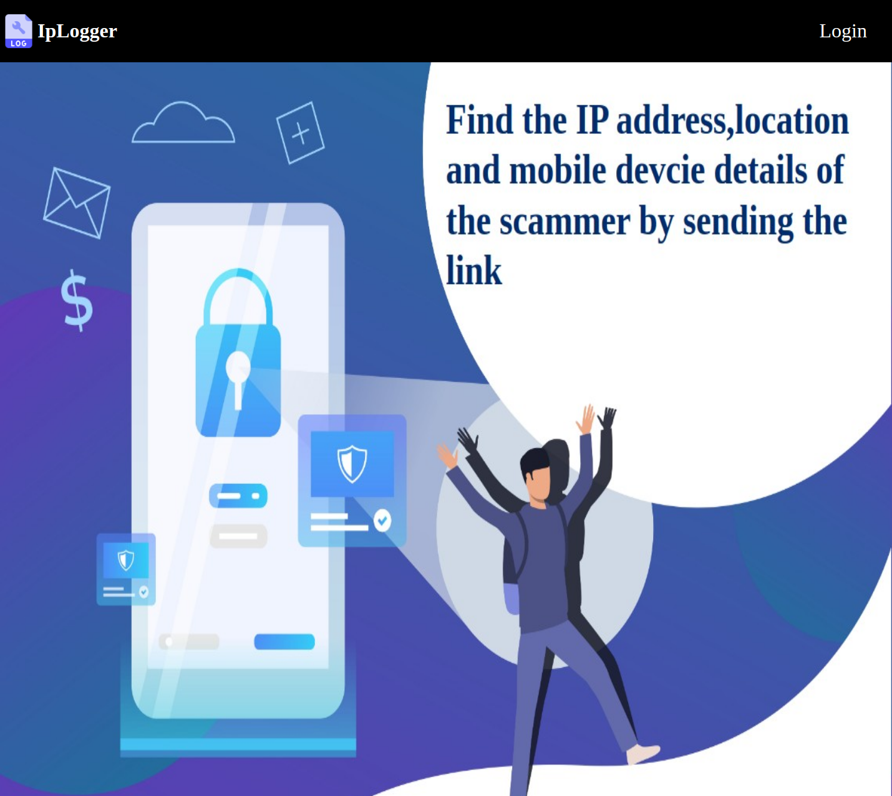
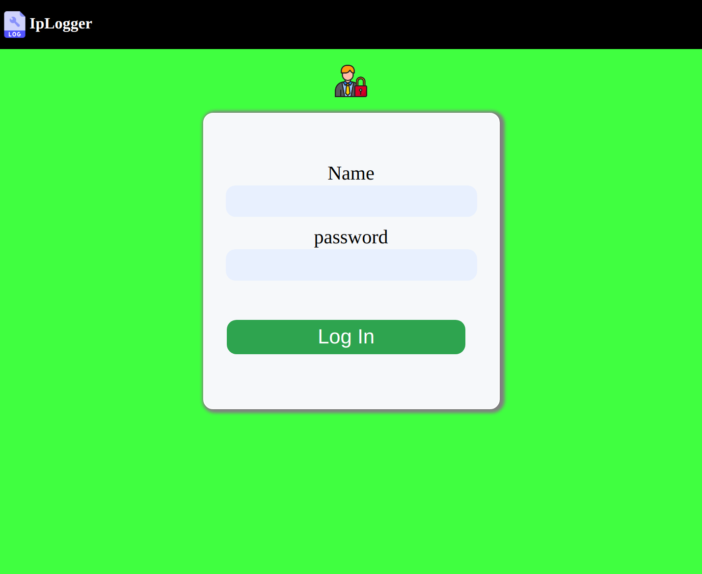
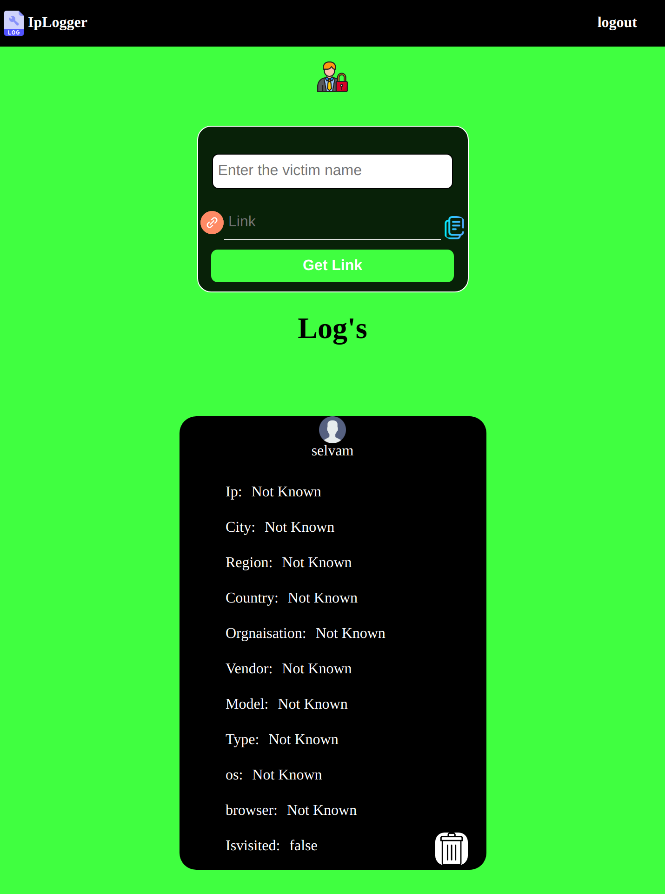

# IpLogger
A web application to log the user ip and user agent 

# Motivation

 I create this website only for my personal use. myself and my friends get's lot spam message in internet to find who is that guy i plan to build the ip logger
by using that i send the link to that person once he vist the website he simply see the error msg that look simillar to no internet acces in chrome browser so he don't get any doubt once he visted his ip is parsed and user agent is stored. by using ipApi (https://ipapi.co/"+ip+"/json/) i get the full detail about the ip and store them in mongo db 

# Tool used

<ul>
  <li>Express js(backend)</li>
  <li>html ,css ,js(forntend)</li>
  <li>Mongodb (database)</li>
</ul>

# How this work

 To use this first we need to login in to the app next enter a victim name and click get the link it will give link copy the link and share with that victim
  now the db model look like 
  
<prev>
  
    {"_id":{"$id":"5fd8c06378439f1dd0d02358"},"isvisited":false,"token":"f74b864b57","victimname":"victimname","__v":{"$numberInt":"0"}}
</prev>
  
and the link in format of https://domain.com/token/?:token by using token only the app find the relvant victim. by using ipApi (https://ipapi.co/"+ip+"/json/) i get the full detail about the ip and store them in mongo db. we can view the victim details in the admin page

# Need to improved

<ul>
  <li>Need to add session for login </li>
</ul>

# How to run 

<ul>
  <li>Clone this repo</li>
  <li>cd IpLogger</li>
  <li>npm install</li>
  <li> add DBURL and USERNAME and PASSWORD in .env file </li>
  <li>npm start</li>
</ul>

# website preview

# Home page

 
# Login page
 

  
# Admin page
  

